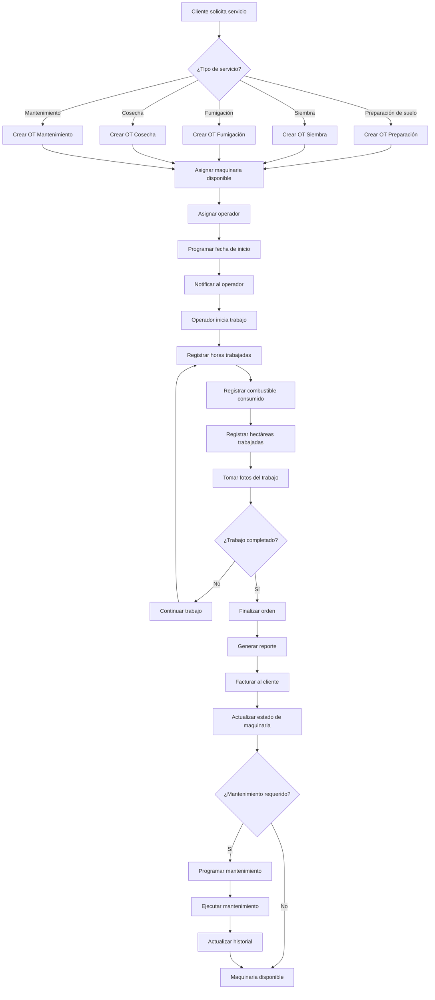

# 3.1 Diagrama BPMN - Flujo de Trabajo AgroTrack FUTAMAQ

## Diagrama BPMN del Proceso Principal de Gestión de Órdenes de Trabajo

## Diagrama BPMN del Proceso de Mantenimiento

## Diagrama BPMN del Proceso de Gestión de Combustible

## Diagrama BPMN del Proceso de Gestión de Repuestos

